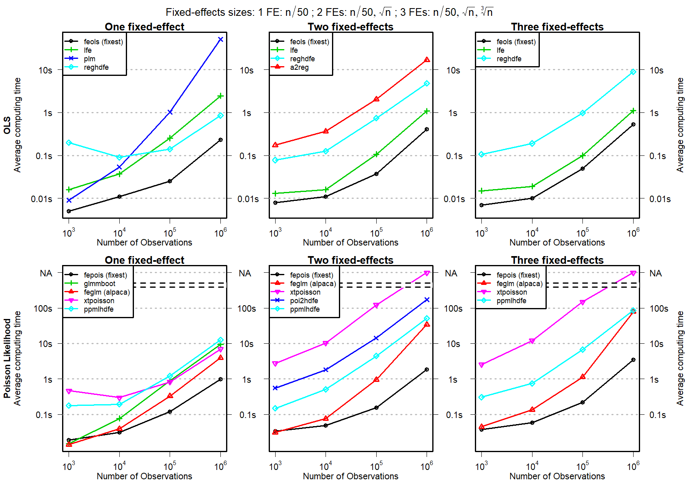
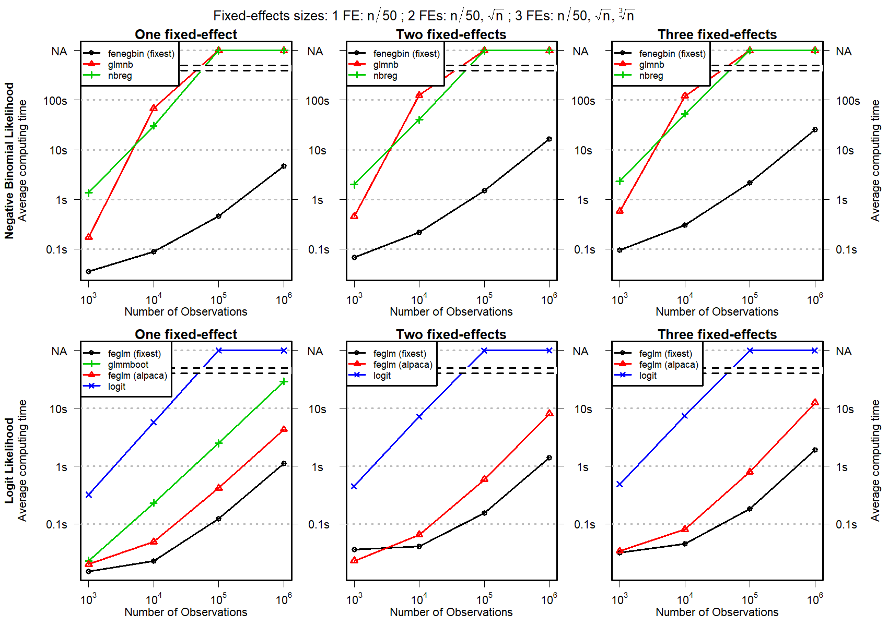

```{r setup, include=FALSE}
knitr::opts_chunk$set(echo = TRUE)
```

The `fixest` package offers a family of functions to perform estimations with multiple fixed-effects in both an OLS and a GLM context. Please refer to the [introduction](fixest_walkthrough.html) for a walk-through.
As of the time of writing of this vignette, `fixest` is the fastest method to perform fixed-effects estimation, often by orders of magnitude. See below for a benchmarking of common estimation models with alternative software. 

## Benchmarking

Here is a comparison of the performance of `fixest` functions to other state of the art methods to perform estimations with multiple fixed-effects. The results are reported in Figure 1 and Figure 2. Package `fixest` is consistently faster in all situations.

{width=100%}

{width=100%}

### Setup

The benchmarking was performed as follows: In the OLS context, we estimate the following equation:

$$y_{ijk} = \alpha_i + \beta_j + \gamma_k + \delta x_{ijk} + \epsilon_{ijk}$$
 
The same functional form (one variable, three fixed-effects) is estimated for the Poisson, the Negative Binomial and the Logit cases (with ad hoc modifications to fit each model). See Berge (2018) for more details on the setup.

Each estimation is replicated 10 times and the average computing time is reported in the figures. 

The alternative methods used for comparison are:

* OLS: felm (R: package lfe), plm (R: package plm), reghdfe (Stata) and a2reg (Stata)
* Poisson: glmmboot (R: package glmmML), feglm (R: package alpaca), xtpoisson (Stata), ppmlhdfe (Stata) and poi2hdfe (Stata)
* Negative Binomial: glm.nb (R: package MASS) and nbreg (Stata)
* Logit: glmmboot (R: package glmmML), feglm (R: package alpaca) and logit (Stata)

All the aforementioned packages were downloaded in July 2019. 

Of course the development of `fixest` has been inspired and pushed forward by (almost all) these (great) packages and I am deeply indebted to their authors. Although `fixest` contains many features, some are still uncovered and you should definitely have a look at these packages. 


